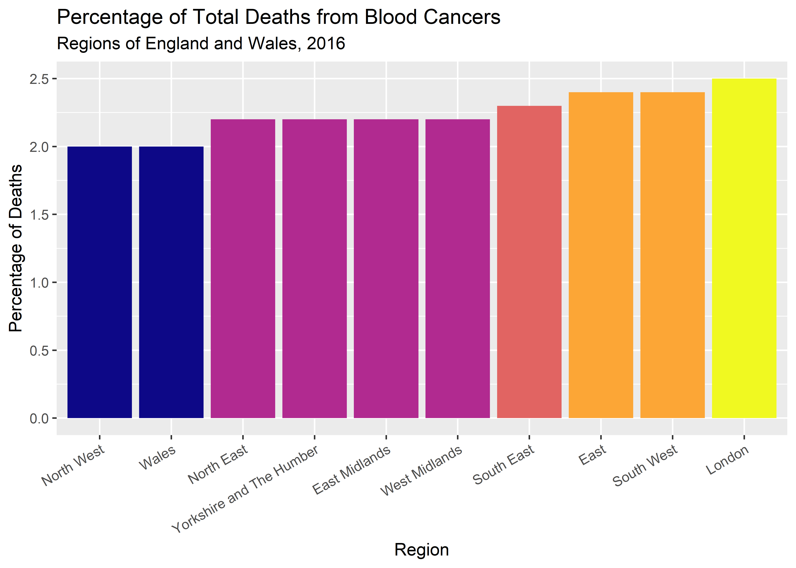

The University of Durham runs the Nomis database of labour market statistics on behalf of the UK's Office for National Statistics [-@ons1981]. As of publication, Nomis contains 1,249 datasets, almost all of which are based around differing statistical geographies. All the data is freely available and does not require users to create accounts to download data, and Nomis provides an interactive web platform for downloading data. However, like all GUI downloading systems, there is a risk that users will select the wrong option without realising their mistake, and downloading multiple datasets is tedious, repetitive work. The `nomisr` package provides functions to identify datasets available through Nomis, the  variables and query options for those datasets, and a function for downloading data, including combining large datasets into a single `tibble` [@muller2018]

`nomisr` is designed around a three stage workflow, with functions for each stage:

1. Identifying available datasets, using the `nomis_data_info()` without any parameters to return a tibble with the names and basic metadata of all available datasets, or the `nomis_search()` function to retrieve a tibble of datasets matching a given search term.

1. Identifying metadata, including "concepts", the name Nomis uses for variables that can be specified when retrieving data. This is done using the `nomis_get_metadata()` function.

1. Downloading data, using the `nomis_get_data()` function, which requires the ID of a given dataset, and accepts parameters specifying the geographic concept (either all geographies of a given area type or one or more specific geographic areas of a given type) and any other concepts used to specify queries. 

`nomisr` is able to return specific releases of a given dataset (to aid reproducible research) or the most recent available data. The `nomis_get_data()` function includes common parameters built into the function, and also accepts unquoted concepts and concept values using quasiquotation [@henry2018], in order to accomodate the wide range of concepts used by different Nomis datasets.

Data downloaded with `nomisr` is in a `tibble` that is ready for plotting (see Figure 1) or mapping with other R packages. Specifying geographies in `nomisr` requires using Nomis' internal geography coding, but all data downloads include standard ONS geography codes to aid mapping.

<!-- -->
Figure 1. Data retrieved with `nomisr` is ready for plotting.

# References
